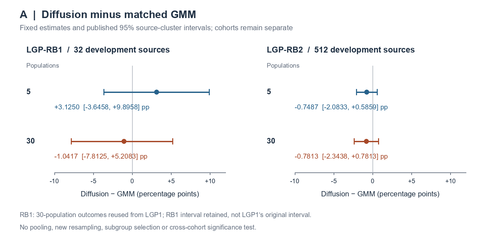
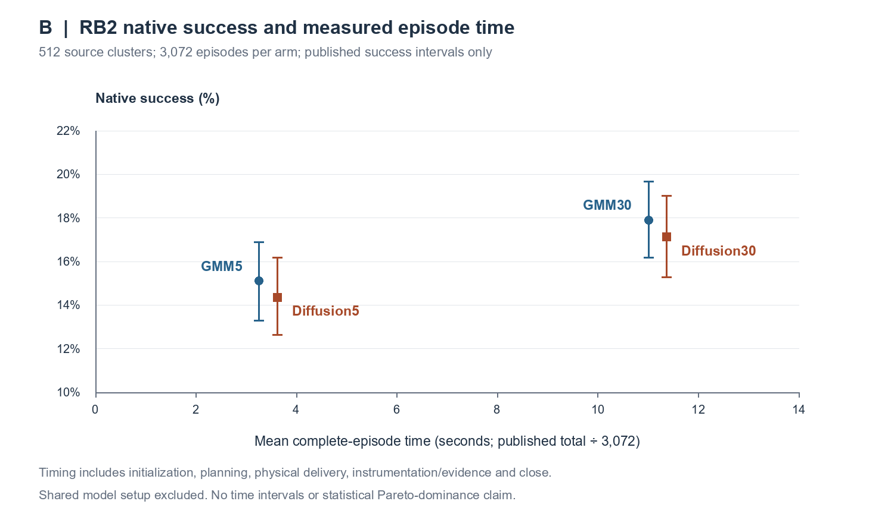

# Local-goal line closure

22 September 2026. Documentation-only synthesis of LGP1, LGP-RB1 and LGP-RB2.
The line is closed for now. Retain continuation; promote neither proposer.
The overall thesis is not declared finished.

## Package

- [Decision, at most one page](DECISION.md)
- [Thesis results and discussion](RESULTS-AND-DISCUSSION.md)
- [32 claim-level evidence records](CLAIMS-AND-EVIDENCE.csv)
- [Figure A, vector](figure-a.svg) and [PNG](figure-a.png)
- [Figure B, vector](figure-b.svg) and [PNG](figure-b.png)
- [Unrounded fixed plotting inputs and immutable provenance](FIGURE-DATA.json)
- [Reproducible plotting script](plot_figures.py)
- [Document/figure/link checks](CHECKS.json), [file identities](MANIFEST.json),
  [local execution accounting](EXECUTION-LOG.json), and [SSD receipt](BACKUP-RECEIPT.json)
- [Completed RB2 monitor's final status](MONITOR-FINAL-STATUS.json)
- [User-supplied authorization](AUTHORIZATION.txt)

This separate documentation branch is `docs/local-goal-line-closure-20260922`,
based on completed published-record commit
`dcf51819b1e0961388856e890b1e3c7f833257fe`. No merge into main is performed.

## Fixed figures



Figure A. Already-published diffusion-minus-GMM estimates and 95% whole-source
intervals at five and thirty scored populations. Panels preserve cohort
separation and share a percentage-point scale. RB1's thirty-population outcomes
are reused LGP1 outcomes, plotted with RB1's own frozen interval, not substituted
for LGP1's original interval. No pooling, resampling or new interval estimation.



Figure B. All four fixed RB2 configurations. Each horizontal coordinate is its
published complete-episode time total divided by 3,072; vertical coordinates
and intervals are copied from the frozen success summary. Time includes World
construction, initialization, planning, physical delivery, instrumentation,
evidence handling and World close, but excludes shared backend/model setup.
There are no time intervals, connecting optimization paths or statistical
Pareto-dominance claims. The vertical axis begins at 10%, not zero, to show the
published uncertainty clearly. Labels and distinct symbols identify both families.

## Reproduction and checks

`plot_figures.py` reads exactly two pinned compact aggregate projections through
`git show`; it does not read trajectories, endpoints, checkpoints or archives.
It requires only standard Python and already available Pillow. It creates
the same two figures in SVG and PNG and a small provenance/data JSON. The
CSV builder uses the bundled Artifact Tool to author the six-column matrix,
exports literal quoted CSV values and checks a full CSV import round trip.
`CLAIMS-PREVIEW.png` is authoring QA, not a third scientific figure.

Local commands used the bundled runtime, no dependency installation. The
`bounded_run.py` wrapper records each document/plot/check execution, restricts
its Windows job to four logical CPUs and 8 GiB aggregate committed memory,
and tracks the two-hour cumulative execution limit. Thread-pool environment
settings are one. The package has a 250,000,000-byte ceiling. Commands can be
reproduced from this worktree using the installed runtime paths in the execution
record and the wrapper, for example:

```text
python bounded_run.py figures python plot_figures.py
python bounded_run.py checks python verify_package.py
```

Source/link checks resolve immutable Git objects locally; they do not assert
public unauthenticated GitHub reachability. Scientific estimates are copied,
not recomputed. The README and discussion retain the original chronology and
claim limits, including earlier E11 and independent PushT findings. No raw
protected data, model calls, new labels, optimizer work, Slurm jobs, GPU
allocations, analyzer reruns or historical integrity audits are part of this task.

The initial link-check parser included adjacent CSV punctuation in one filename.
It was corrected to read parsed CSV fields; that failed authoring check remains
in the execution log. No scientific source or result changed.

## Preservation and limits

The accepted [scientific result at 0b6507f](https://github.com/ckontz01/diffusion-world-model-planning-thesis/blob/0b6507fc7398eb0624d0755035db22e666de74d5/docs/local-goal-source-replication-publication-20260920/completion-v6/FINAL-REPORT.md)
and [R1 location record at 28cbcf1](https://github.com/ckontz01/diffusion-world-model-planning-thesis/blob/28cbcf18ec16bcb496132c7c9bd0204a7cf2eca9/docs/local-goal-source-replication-publication-20260920/preservation-recovery-r1/LOCATION-AND-RECEIPT.md)
are referenced unchanged. Their verified archive/historical union is not read,
rehash-checked, recreated or transferred again. Only this new small closure
package, including a snapshot of the updated root README, is copied to the
designated THESIS_SSD, with each copied file checked against its SHA-256.

No required source is unresolved. Inherited limits remain explicit: old
thirty-population complete-episode/reset times were not saved; E11 retains its
released-task-callable definition and original interface; fixed seed blocks
do not establish a population-of-training-seeds result. None is filled with an
assumption or a new analysis. A separate publication manifest and backup receipt
identify the generated files. The final receipt is self-excluded from its own
manifest to avoid a circular hash; its copied bytes are checked separately.
